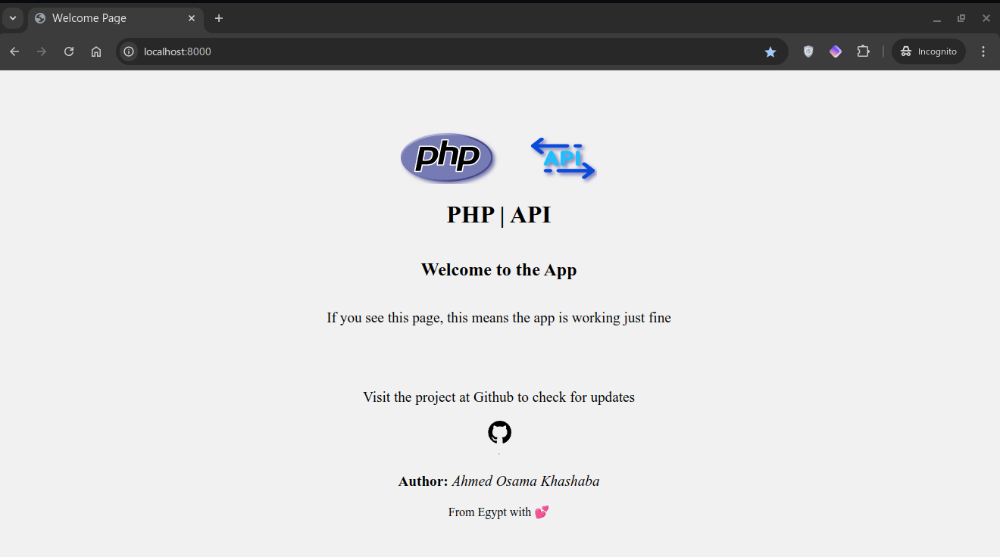

# PHP API
- This is a simple php-api project to make an API for your application using PHP native.

## REQUIRMENTS
- PHP v8.0 or higher.
- composer

## Download and install 
```bash
git clone https://github.com/ahmed-osama2022/php-api
cd php-api
composer install
```
- Then serve the public folder
```bash
# if you're using php-cli 
php -S localhost:8000 -t public
```


### example of .env file
- You should put your ```.env``` file at the root folder in the project.
```env
DB_HOST=
DB_NAME=
DB_PORT=
DB_USER=
DB_PASS=
```

### Check if it is working fine
- If you start serving the project you should see this welcome page at your serving link.

- Welcome Page

- Test route


### How to work with?
#### NOTE: This library uses ```MVC``` in the structure.
#### NOTE: This project uses ```psr-4 autoloader``` for the ```src``` and ```App``` folder.

- Put all your credentials for the database in the ```.env``` file.

- Define all your routes as explained in the ```src/Router.php``` file.

- You will see an example in the files to tell you How to use it fine.

- Start making the logic of your application as contrllers you defined in the ```App/controllers``` folder.
